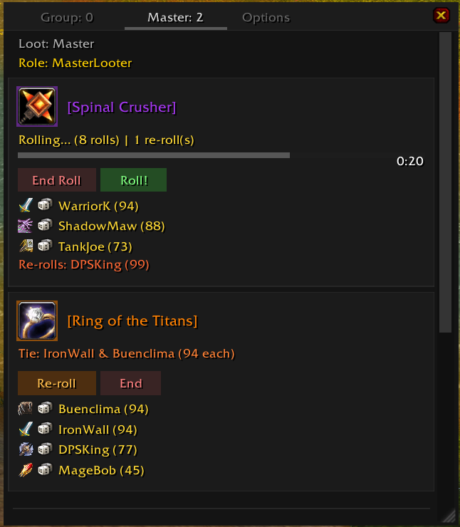
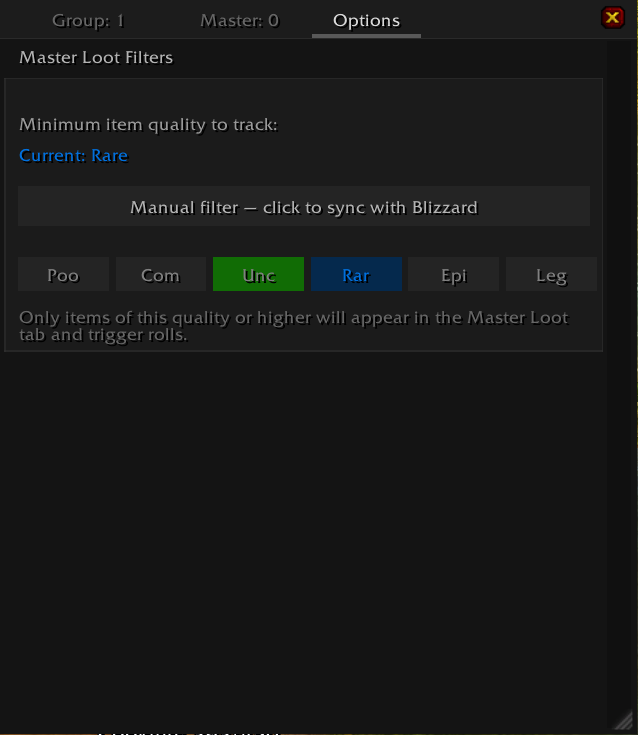

# Looty

A lightweight Master Loot & Group Loot addon for **WoW WotLK (3.3.5)**. Tracks rolls in real-time, gives the Master Looter full control over loot distribution, and syncs automatically to other players using the addon — no configuration needed.

## Screenshots

**Master Loot Dashboard**

**Options — Quality Filter**

## Why Looty?

WoW's default loot windows are slow, cluttered, and disappear after a roll. Looty keeps everything visible in one scrollable window: who rolled, what they rolled, who's winning, and when the timer expires.

Whether you're a raid leader managing drops or a player tracking your rolls, Looty makes loot transparent and organized.

## Features

### Group Loot Tracking
- **Hooks into Blizzard's native Group Loot system** — captures roll results automatically
- Sections players by their choice: **Need**, **Greed**, **Disenchant**, **Pass**
- Accordion panels per roll — expand to see who rolled what value
- Winner highlighted in green, timer countdown on active rolls
- Roll history with a "Clear History" button

### Master Loot Control
- **Full ML dashboard** — see all items from a corpse at a glance
- **Start, end, and re-assign rolls** with one click
- **Tie detection** — automatically detects ties and offers a re-roll button
- **Re-roll protocol** — only tied players can re-roll, raiders see their eligibility status
- **Mark items done** — track what's been distributed
- **Raider sync** — ML broadcasts item data and roll states to all players using Looty

### Quality Filter
- Six-tier quality filter (Poor → Legendary) to control which items appear
- **Sync with Blizzard** — toggle to follow the default WoW loot threshold instead
- Filter syncs automatically from ML to Raiders

### UI
- Scrollable, resizable window with drag support
- Class icons next to every player name
- Live timer bars with color-coded urgency (grey → yellow → red)
- Three tabs: **Group** (group loot), **Master** (ML dashboard), **Options** (settings)

## No Sync? No Problem

Looty works in two modes:

1. **Addon sync** — when ML and Raiders use Looty, everything syncs automatically (items, rolls, filters, tie re-rolls)
2. **Standalone** — Group Loot tab hooks into Blizzard's native system; Master Loot tab listens to /roll messages in raid chat

You always get value, regardless of how many people are using Looty.

## Installation

1. Download the addon
2. Place the `Looty` folder in `Interface/AddOns/`
3. Reload or restart WoW
4. Type `/looty` to open the window

## Commands

| Command | Description |
|---------|-------------|
| `/looty` | Toggle the Looty window |
| `/looty lock` | Toggle window lock (prevents dragging/resizing) |
| `/looty clear` | Clear group loot history |
| `/looty debug` | Toggle debug logging |
| `/lr` | Short alias for `/looty` |

## Compatibility

- **WoW 3.3.5a (Wrath of the Lich King)**
- Works with any loot method (Group Loot, Need Before Greed, Master Loot)
- No external libraries required
