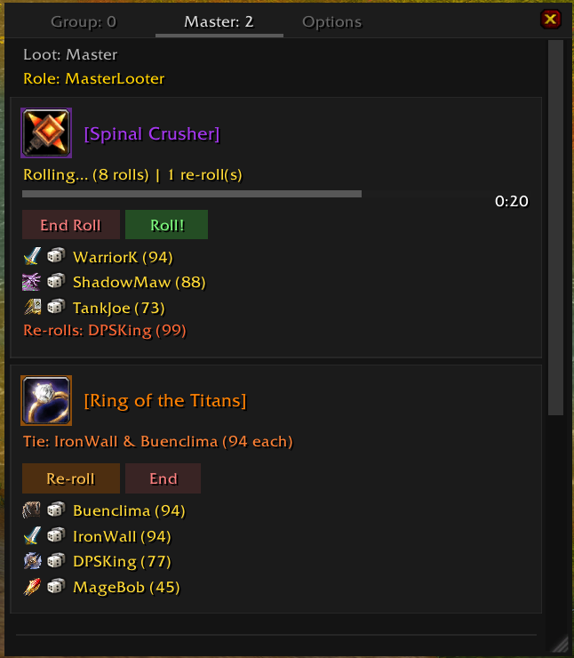
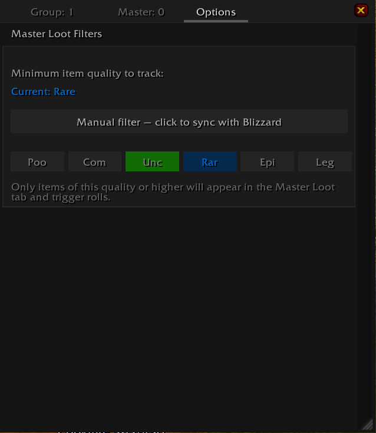

# Looty

A lightweight Master Loot & Group Loot addon for **WoW WotLK (3.3.5)**. Tracks rolls in real-time, gives the Master Looter full control over loot distribution, and syncs automatically to other players using the addon — no configuration needed.

## Screenshots

**Master Loot Dashboard**

**Options — Quality Filter**

## Why Looty?

WoW's default loot windows are slow, cluttered, and disappear after a roll. Looty keeps everything visible in one scrollable window: who rolled, what they rolled, who's winning, and when the timer expires.

Whether you're a raid leader managing drops or a player tracking your rolls, Looty makes loot transparent and organized.

## Features

### Group Loot Tracking
- Captures roll results from the native Group Loot system as they happen
- Organizes players by choice: **Need**, **Greed**, **Disenchant**, **Pass**
- Expand each roll to see who rolled what value
- Winner highlighted in green, live countdown on active rolls
- "Clear History" button to reset

### Master Loot Control
- View all looted items across the entire raid, accumulated as you clear bosses
- Start, end, and restart rolls with a single button (label changes to "Re-Roll" after the first roll)
- Ties detected automatically — only tied players can re-roll
- **Award items in one click**: automatically gives the item to the winner, whether the loot window is open or the item is in your bags (no manual targeting required)
- **Override the winner**: choose any raid member from a dropdown if you want to award differently
- "Done" button to mark distributed items
- Syncs everything to raiders who also use Looty

### Quality Filter
- Six-tier filter (Poor → Legendary) to control which items appear in the UI
- Automatically follows WoW's default loot threshold if you toggle the option
- Filter applies instantly to existing items — no need to re-open the loot window
- Syncs automatically from Master Looter to Raiders

### UI
- Scrollable, resizable window that remembers its position
- Class icons next to every player name
- Timer bars that change color as time runs out (grey → yellow → red)
- Three tabs: **Group** (your rolls), **Master** (ML dashboard), **Options** (settings)

## No Sync? No Problem

Looty works in two modes:

1. **Addon sync** — when ML and Raiders both use Looty, everything syncs automatically (items, rolls, filters, award state)
2. **Standalone** — Group Loot hooks into WoW's built-in system; Master Loot still tracks rolls and items locally

You always get value, regardless of how many people are using Looty.

## Installation

1. Download the addon
2. Place the `Looty` folder in `Interface/AddOns/`
3. Reload or restart WoW
4. Type `/looty` to open the window

## Commands

| Command | Description |
|---------|-------------|
| `/looty` | Open or close the Looty window |
| `/looty lock` | Lock the window in place (prevents dragging/resizing) |
| `/looty clear` | Clear group loot history |
| `/lr` | Shortcut — same as `/looty` |

## Compatibility

- **WoW 3.3.5a (Wrath of the Lich King)**
- Works with any loot method (Group Loot, Need Before Greed, Master Loot)
- No external libraries required
